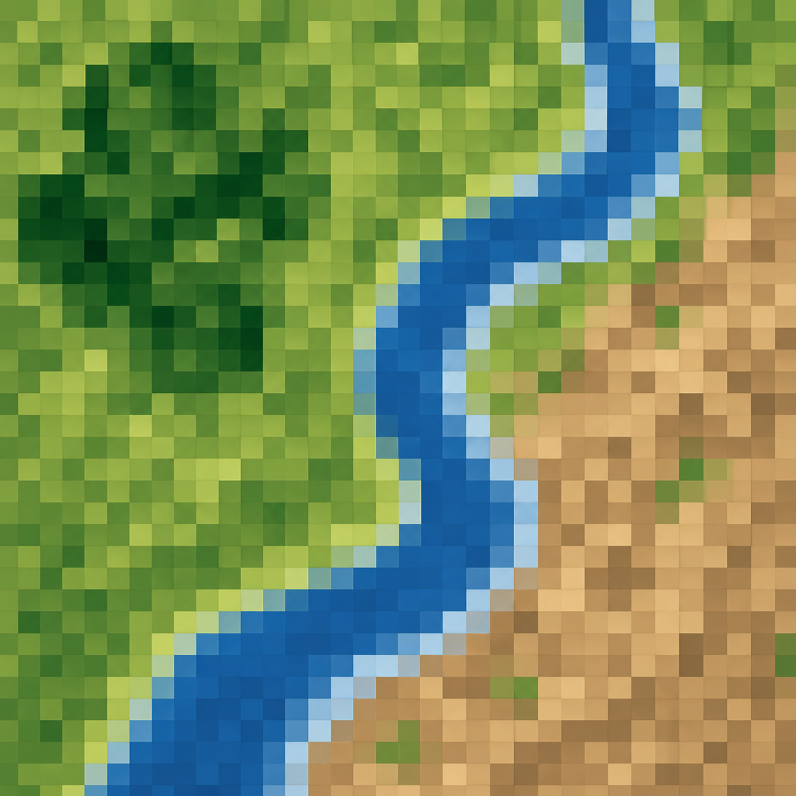

<p align="center">
  
</p>

# SCS Curve Number Generator

CN Generator is a local tool for creating SCS Curve Number maps and summary statistics from soil and land use data. It runs in your browser, but the processing happens on your own computer.

The app can be used in two ways:

1. Download the Windows zip package if you only want to run the tool.
2. Clone the source code if you want to inspect, modify, or develop the app.

## Option 1: Windows Zip Package

This is the easiest option for most users. It does not require installing Python.

1. Go to the GitHub Releases page for this repository.
2. Download `CN_Generator_Windows_<version>.zip`.
3. Right-click the zip file and choose **Extract All**.
4. Open the extracted folder.
5. Double-click `CN_Generator.exe`.
6. Keep the CN Generator window open while using the app.

If Windows SmartScreen appears, choose **More info**, then **Run anyway** if you trust the download.

The package includes:

- `CN_Generator.exe`, the main app launcher.
- `README.txt`, a short guide for zip users.
- `Sample Data\HUC10 Example`, example files for testing.
- `Create_Shortcuts.bat`, an optional helper that creates a folder shortcut and Desktop shortcut.
- `_internal`, bundled runtime files used by the app. This folder is hidden because most users do not need it.

## Option 2: Source Code For Developers

Use this option if you want to review the code, customize the app, or build a new release package.

Requirements:

- Windows, macOS, or Linux for development.
- Python 3.10 or newer. Python 3.11 is recommended.
- A clean virtual environment.

Setup:

```bash
python -m venv .venv
.venv\Scripts\activate
python -m pip install --upgrade pip
python -m pip install -r requirements.txt
python app.py
```

On Windows, you can also double-click:

```text
CN_Generator.bat
```

The batch launcher creates `.venv`, installs dependencies, handles proxy prompts when needed, and starts the local app.

## Sample Data

Example files are included in:

```text
data/HUC10 Example/
```

Suggested test inputs:

- Soil layer: `SoilData_SandCreek.zip`
- Land use layer: `NLCD2024_SandCreek.zip`
- Optional watershed layer: `SandCreek_HUC10.zip`

The folder also includes a spreadsheet and verification notes to help check expected results.

## Building The Windows Package

Install the developer/build dependencies:

```bat
.venv\Scripts\python.exe -m pip install -r requirements-dev.txt
```

Build the package:

```powershell
powershell -ExecutionPolicy Bypass -File tools\build_windows_package.ps1 -Version 1.0.0
```

The build creates:

```text
release/CN_Generator_Windows_1.0.0/
release/CN_Generator_Windows_1.0.0.zip
```

Upload the zip file to a GitHub Release so non-developer users can download it.

## Features

- Upload soil and land use datasets and compute CN polygons and a CN raster.
- Use the built-in NLCD lookup or provide a custom CSV lookup table.
- Automatically handle CRS mismatch and dual hydrologic groups such as `A/D`, `B/D`, and `C/D`.
- Optionally upload watershed boundaries to compute zonal statistics per basin.
- View an interactive map and HTML report.
- Export CN polygons as GeoPackage and CN raster as GeoTIFF.

## Input Data Requirements

- Soil: vector dataset with a hydrologic soil group field containing values `A`, `B`, `C`, `D`, or dual forms such as `A/D`, `B/D`, `C/D`.
- Land use: vector dataset with a numeric land use code field. The built-in NLCD option expects NLCD class codes.
- Accepted formats: zip-compressed Shapefile set, GeoPackage, or GeoJSON.
- For Shapefiles, upload a `.zip` that includes `.shp`, `.shx`, `.dbf`, and `.prj`.

## Processing Overview

1. Validate uploaded soil, land use, and optional watershed files.
2. Load geospatial layers with GeoPandas.
3. Load the built-in NLCD lookup table or a custom CSV lookup.
4. Reproject data to the selected EPSG code when needed.
5. Replace dual hydrologic soil groups using the selected UI choices.
6. Intersect soil and land use polygons.
7. Assign Curve Numbers from the lookup table.
8. Dissolve polygons by CN value and calculate area.
9. Rasterize the CN polygons to GeoTIFF.
10. Compute global and optional watershed zonal statistics.
11. Build the report, interactive map, and downloadable outputs.

## Project Structure

```text
.
|-- app.py
|-- CN_Generator.bat
|-- Create_Desktop_Shortcut.bat
|-- LICENSE.md
|-- requirements.txt
|-- Logo/
|   |-- CN_Generator.png
|   `-- CN_Generator.ico
|-- data/
|   |-- HUC10 Example/
|   `-- lookup_tables/
|-- src/
|   |-- curve_number_calculator.py
|   |-- spatial_operations.py
|   |-- cn_statistics.py
|   `-- visualization.py
`-- tools/
    |-- build_windows_package.ps1
    |-- create_shortcut.ps1
    |-- install_dependencies.ps1
    |-- package_create_shortcuts.bat
    `-- PACKAGE_README.txt
```

## License

CN Generator is free for personal, non-commercial use.

For commercial use, paid consulting, internal business use, client deliverables, training, workshops, course material, demonstrations for paid services, or videos and media created for commercial purposes, please contact Mohsen Tahmasebi Nasab:

https://www.hydromohsen.com/

This software is provided as-is, without warranty of any kind. Always verify results before using them in analysis, design, or decision making.

## References

- USDA NRCS SCS Curve Number method
- USACE HEC-HMS guidance for CN grids
- National Land Cover Database
- GeoPandas, Rasterio, rasterstats, Folium, and Gradio
